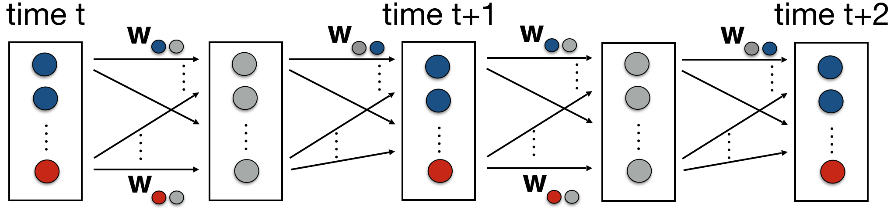

# FD-SAT-Plan

Factored Deep SAT Planner (FD-SAT-Plan) [1] is a two-stage planner based on the learning and planning framework [2] that (i) learns the state transition function T(st,at) = st+1 of a factored [3] planning problem using Binarized Neural Networks [4] from data, and (ii) compiles multiple copies of the learned transition function T'(...T'(T'(T'(I,a0),a1),a2)...) = G (as visualized by Figure 1) into CNF and solves it using off-the-shelf SAT solver [5,6]. FD-SAT-Plan can handle both discrete and continuous action/state spaces, arbitrarily complex state transition functions, pseudo-boolean constraints on actions/states and pseudo-boolean reward functions.

Figure 1: Visualization of the learning and planning framework presented in [2] where red circles represent action variables, blue circles represent state variables, gray circles represent the activation units and w's represent the weights of the neural network.

## Improvements

I always look for ways to improve the runtime performance and memory efficiency of FD-SAT-Plan. Since the publication [1], the performance of FD-SAT-Plan has significantly (1-2 orders of magnitude!) improved due to more compact encodings of the binarized activation functions. Namely: 

i) cardinality networks [7] with bi-directional clauses are currently used to replace the sequential cardinality [8] constraints used in [1]. Similar to [9], the cardinality constraints are conjoined with equivalence constraints (Note that [9] uses sequential counters [8] with O(nk) variables and clauses instead of cardinality networks [7] with O(nlog2k2) variables and clauses). 

ii) cardinality constraints (i.e., sum1..i..n xi >= k) are 'flipped' (i.e., sum1..i..n -xi <= n-k) when k > n/2.

Moreover, FD-SAT-Plan

iii) includes parsers for domain files that read in pseudo-boolean expressions of form: sum1..i..n xi <= k. See translation folder for more details.

iv) handles reward functions with pseudo-boolean expressions and can call any off-the-shelf Weighted Partial MaxSat solver.

v) can make use of known transition functions (i.e., the transition function for a subset of state variables can be provided as input - see Inventory Control example).

## Dependencies

i) Data collection (input to training BNN [4]): Data is collected using the RDDL-based domain simulator [10]. 

ii) Training BNN: The toolkit [11] is used to train BNNs. The final training parameters were recorded into bnn.txt and normalization.txt files.

iii) Compilation to CNF: The toolkit [12] is called in fd_sat_plan.py to get commandline arguments and to write the list of literals into the DIMACS CNF format.

iv) Solver: Any off-the-shelf SAT solver or Weighted Partial MaxSat works. In our paper [1], we used Glucose SAT solver [5]. For FD-SAT-Plan+ (i.e., with reward considerations) Weighted Partial MaxSat solver[6] is used.

For i) any domain simulator and for ii) any BNN training toolkit works. Example bnn.txt, normalization.txt and domain files (under translation folder) are provided for navigation, inventory and sysadmin domains. Therefore to run the planner, you will only need iii) and iv).

## Running FD-SAT-Plan

fd_maxsat_plan.py -d domain -i instance -h horizon -o optimize

Example: python fd_maxsat_plan.py -d navigation -i 3x3 -h 4 -o False

## Verification Task

FD-SAT-Plan can also be used to verify different properties of BNNs by setting horizon -h to 1.

## Citation

If you are using FD-SAT-Plan, please cite the papers [1,2].

## References
[1] Buser Say, Scott Sanner. [Planning in Factored State and Action Spaces with Learned Binarized Neural Network Transition Models](./bnn-planning-factored.pdf). In 27th IJCAI-ECAI, 2018.

[2] Buser Say, Ga Wu, Yu Qing Zhou, and Scott Sanner. [Nonlinear hybrid planning with deep net learned transition models and mixed-integer linear programming](http://static.ijcai.org/proceedings-2017/0104.pdf). In 26th IJCAI, pages 750–756, 2017.

[3] Craig Boutilier, Thomas Dean, and Steve Hanks. Decision-theoretic planning: Structural assumptions and computational leverage. JAIR, 11(1):1–94, 1999.

[4] Itay Hubara, Matthieu Courbariaux, Daniel Soudry, Ran El-Yaniv, and Yoshua Bengio. Binarized neural networks. In 29th NIPS, pages 4107–4115. Curran Associates, Inc., 2016.

[5] Gilles Audemard and Laurent Simon. Lazy Clause Exchange Policy for Parallel SAT Solvers, pages 197–205. Springer Int. Publishing, 2014.

[6] Jessica Davies, Fahiem Bacchus. Solving maxsat by solving a sequence of simpler sat instances. Principles and Practice of Constraint Programming, pages 225–239, 2011.

[7] Roberto Asin, Robert Nieuwenhuis, Albert Oliveras, Enric Rodriguez-Carbonell, Cardinality Networks and their Applications. International Conference on Theory and Applications of Satisfiability Testing, pages 167-180, 2009.

[8] Carsten Sinz. Towards an Optimal CNF Encoding of Boolean Cardinality Constraints, pages 827–831. Springer Berlin Heidelberg, Berlin, Heidelberg, 2005.

[9] Nina Narodytska, Shiva Prasad Kasiviswanathan, Leonid Ryzhyk, Mooly Sagiv, Toby Walsh. Verifying Properties of Binarized Deep Neural Networks. In 32nd AAAI, pages 6615-6624, 2018.

[10] Scott Sanner. Relational dynamic influence diagram language (rddl): Language description. 2010.

[11] Matthieu Courbariaux. BinaryNet. https://github.com/MatthieuCourbariaux/BinaryNet

[12] Christian Muise. KR Toolkit: Knowledge Representation AI Toolkit. https://bitbucket.org/haz/krtoolkit/wiki/Home
